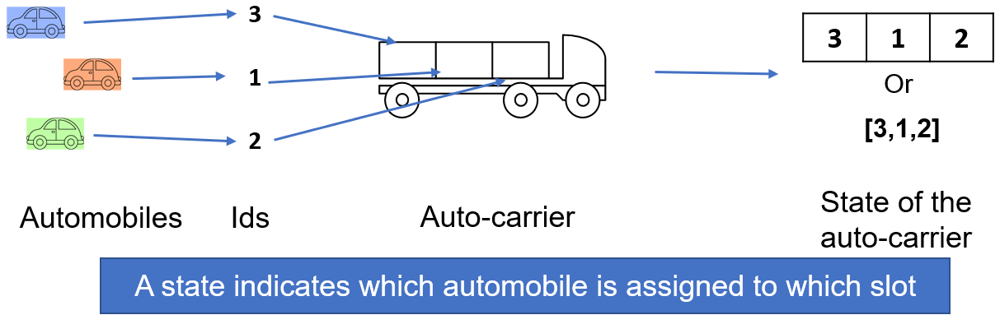

## Background
This is a part of the code I used in the computation analysis of my dissertation and published an article (Kirtonia, et al., 2023).<br/>
Automobiles are transported using large trucks which are known as auto-carriers. There are some fixed number of slots that hold automobiles are known as auto-carrier slots. Automobiles can be of various types depending on the size of them. We define three types of automobiles as Type 1 (T1), Type 2 (T2), and Type 3 (T3) that represents small, medium and large automobiles. Various rules depending on the auto-carrier structure and automobile types prohibit the automobile assignment to the auto-carrier slots. Those rules are called loading constraints. A loading state indicates a feasible assignment of automobiles to the auto-carrier slots. The following Figure 1 shows how these assignments are represented as an array of automobile IDs.
<p align="center">
    
</p>
<p align="center">
    Figure 1: Loading state representation
</p>
## Loading constraints
There are three types of loading constraints considered in this project (Chen, 2016). Below the loading constraints are described: <br/>
1. **Single-car constraint**: Certain types of cars can not be assigned to certain slots. For Example, T3 automobile can not be assigned to slot 1.<br/>
2. **Pairwise constraint:** If a certain type of automobile is assigned to a certain slot, some type of automobile cannot be assigned to some other slots. For example, if T2 automobile is assigned to slot 1, T3 automobile can not be assigned to slot 2.<br/>
3. **Double slot constraint:** If some type of automobile is assigned to a certain slot it also occupies some other slots. For example, assigning T3 automobile to slot 2 also occupies slot 3.<br/>
## What does this class do?
The LoadingStatesGenerator class takes information about the automobile type, slot IDs and the loading constraint to be initialized. The output is a list of all feasible assignments of automobiles to the auto-carrier slots so that the assignments do not violate the prohibitions defined by the loading constraints. Each feasible assignment is called a loading state. 

## Solution approach
This problem is formulated as a Constraint Programming Problem and solved by Google's OR-Tools Python library. 
Mathematical formulation:
| **Sets**    | <!-- -->    |
|----|---|
| $I$  | Set of automobiles  |
| $S$  | Set of auto-carrier slots |
| $T$  | Set of automobile types |
| $C_s$  | Set of single car constraints |
| $C_d$  | Set of double slot constraints |
| $C_p$  | Set of pairwise constraints |
| $I^t$  | Set of automobiles of type $t$ |
|**Index**|<!-- --> |
| $i$  | Index of automobiles |
| $s$, $s_1$ or $s_2$  | Index of auto-carrier slots |
| $t$, $t_1$ or $t_2$  | Index of automobile types |
| $u$, $v$ or $w$  | Index of constraints set $C_s$,  $C_d$, $C_p$|
|**Parameter**|<!-- --> |
| $M$  | A very large number |
|**Decision Variable**|<!-- --> |
| $x_i$  | Assigned slot number of automobile $i$ |

#### Constraints
Since $x_i$ indicates the slot number of the automobile $i$, slot number for each automobile must be unique which is represented by the following global constraint.
$$alldifferent(x_i)$$
Single car constraints: 
$$x_i \neq s \quad \forall i \in I_t, \forall(t, s)\in C_s$$

Pairwise constraints: 
$$if \quad x_{i_1} = s_1, \quad then \quad x_{i_2} \neq s_2 \quad \forall i_1 \in I^{t_1}, \forall i_2 \in I^{t_2}, \forall(t_1, s_1, t_2, s_2)\in C_p$$
Double slot constraints: 
$$if \quad x_{i_1} = s_1, \quad then \quad x_{i_2} \neq s_2 \quad \forall i_2 \in I\setminus i_1, \forall i_1 \in I^{t}, \forall(t, s_1, s_2)\in C_d$$

The domain of the variables:
$$x_i \in \lbrace 1,2,..., |S| \rbrace \quad \forall i \in I$$

This type of conditional constraint can be modeled using the Channeling constraints available on OR-Tools.

## Preparing input
Suppose we have a 3-slot auto-carrier and have three automobiles with automobile id 1, 2, and 3 and their corresponding types are T1, T2 and T3, respectively. The inputs am_types, slot_ids are defined as below:
```python
am_types = {1: "T1", 2: "T2", 3: "T3"}
slot_ids = [1, 2, 3]
```
The three types of constraints are defined as follows:
Single-car constraints: a list of tuples where each item (t, s) indicates that automobiles of type t can not be assigned to slot s.
```python
single_car = [("T3", 1)]
```
Pairwise constraint: a list of tuples where each item (t1, s1, t2, s2) indicates that if an automobile of type t1 is assigned to slot s1, another automobile of type t2 can not be assigned to slot s2.
```python
pairwise = [("T2", 1, "T3", 2)]
```
Double slot constraint: a list of tuples where each item (t, s1, s2) indicates that automobiles of type t occupy both slot s1 and s2.
```python
double_slot = [("T3", 2, 3)]
```
Finally, with all types of constraints, the input for the class is prepared as follows:
```python
constraints = (single_car, double_slot, pairwise)
```
### Example 1: No loading constraints
```python
from LoadingStatesGenerator import LoadingStatesGenerator
am_types = {1: "T2", 2: "T2", 3: "T3"}
slot_ids = [1, 2, 3]
single_car, pairwise, double_slot = [], [], []
constraints = (single_car, double_slot, pairwise)
generator = LoadingStatesGenerator(am_types, slot_ids, constraints)
states = generator.generate()
for state in states:
    print(state, end=", ")
```
Output: Since there is no loading constraints, all possible assignments are provided by the code.
```python
[3, 2, 1], [2, 3, 1], [3, 1, 2], [2, 1, 3], [1, 3, 2], [1, 2, 3],
```
### Example 2: With one single car constraint
Changing the loading cost in the above code:
```python
single_car, pairwise, double_slot = [("T3", 1)], [], []
```
Output: Since automobile 3 is of T3, it's not assigned to the first slot.
```python
[2, 3, 1], [1, 3, 2], [1, 2, 3], [2, 1, 3],
```
## References:
Chen, H. K. (2016). A heuristic algorithm for the auto-carrier loading problem. International Journal of Shipping and Transport Logistics, 8(1), 21-50. <br />
Kirtonia, S. K., Sun, Y., & Chen, Z. L. (2023). Selection of auto-carrier loading policy in automobile shipping. IISE Transactions, 1-20.
